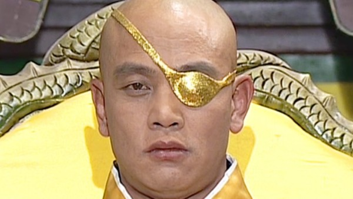
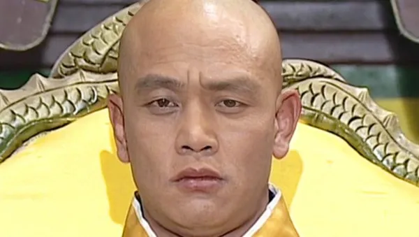
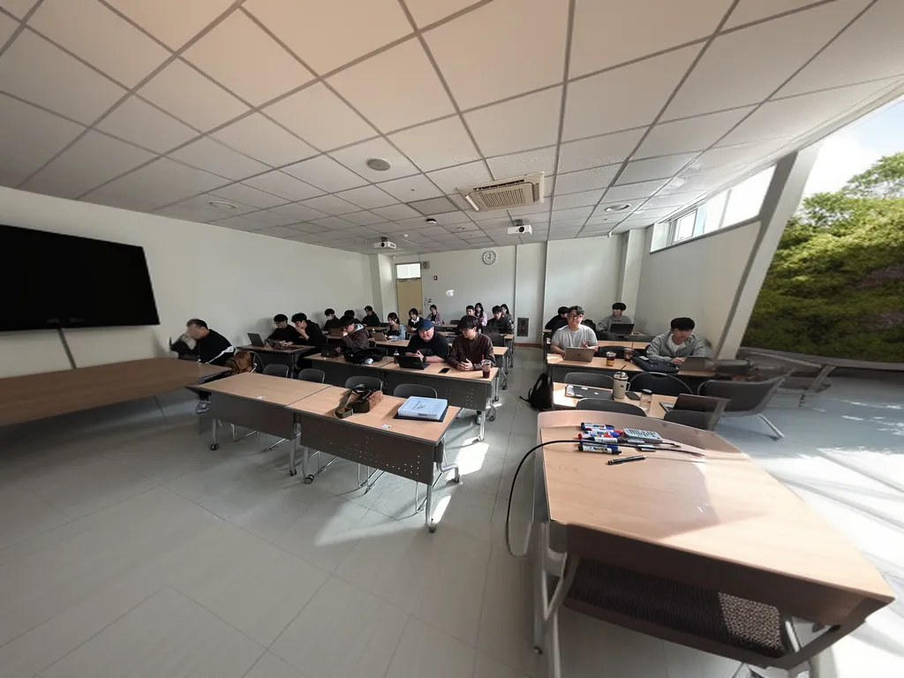
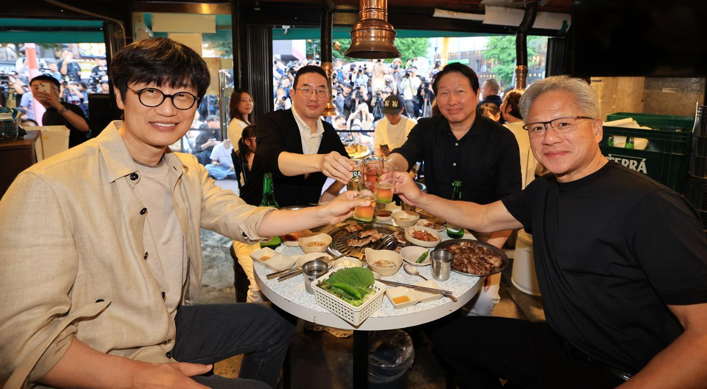
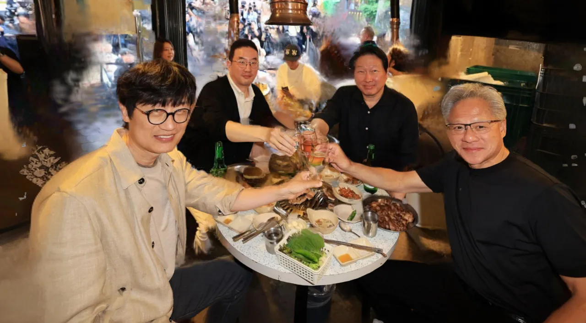

# Deep Learning Assignment — Foundation Model Tasks

Hugging Face foundation model 기반 **통합 데모** 코드

## OpenEdit

iOS 27 사진편집 3기능(Clean Up · Expand · Reframe)을 오픈 파운데이션 모델로 재현한 통합 Gradio 앱

### Before / After

#### Clean Up — 객체 제거

| Before | After |
| ------ | ----- |
|  |  |

`sample.jpg` · SAM2 마스크 + Qwen2-VL 캡션 + DreamShaper 인페인팅

#### Expand — 프레임 확장

| Before | After |
| ------ | ----- |
|  |  |

`sample2.jpg` · LaMa 미리보기 + DreamShaper 아웃페인팅

#### Reframe — 시점 변경

| Before | After |
| ------ | ----- |
|  |  |

`sample3.jpg` · SHARP 3D Gaussian + gsplat 렌더 + DreamShaper 디오클루전

---

## Repository

```cmd
git clone https://github.com/kharabiner/deeplearning-demo.git
cd deeplearning-demo
```

---

## Installation

**Python 3.10 필수** (Windows에서 gsplat CUDA wheel + torch 2.4.1+cu124 조합). Python 3.11 `.venv`는 Reframe gsplat 미지원(torch splat 폴백만 가능).

### 사전 요구사항


| 항목              | Windows                  | Linux (Ubuntu/Debian)                            | macOS                      |
| --------------- | ------------------------ | ------------------------------------------------ | -------------------------- |
| **Python 3.10** | 아래 설치                    | `sudo apt install -y python3.10 python3.10-venv` | `brew install python@3.10` |
| **git**         | `winget install Git.Git` | `sudo apt install -y git`                        | `brew install git`         |
| **NVIDIA GPU**  | Reframe gsplat 권장        | 동일                                               | gsplat 미지원 — Reframe 비권장   |


**Python 3.10 (Windows)** — `scripts\setup.ps1`은 `py -3.10` 런처를 사용합니다:

```cmd
winget install Python.Python.3.10
py -3.10 --version
```

python.org 설치 시 **“Install launcher for all users”** 옵션을 켜 두세요. 설치 후 새 터미널을 열어 확인합니다.

**NVIDIA (Reframe gsplat):** CUDA Toolkit 별도 설치 없이 **GPU 드라이버**만 필요합니다. torch **2.4.1+cu124** wheel은 [PyTorch](https://pytorch.org) 기준 **CUDA 12.4** 호환 드라이버(보통 545+)가 있어야 합니다.

### Windows (한 번에 설치)

위 **Repository** 섹션에서 clone한 뒤:

```cmd
cd deeplearning-demo
powershell -ExecutionPolicy Bypass -File scripts\setup.ps1
.venv\Scripts\activate
python demo.py
```

`scripts\setup.ps1`이 **apple/ml-sharp clone**(Reframe) → Python 3.10 `.venv` 생성 → **torch 2.4.1+cu124 · gsplat · diffusers 0.36.0** 등을 설치합니다. Python 3.10·git이 없으면 스크립트가 종료되며, Python 3.10은 `winget install Python.Python.3.10` 안내가 출력됩니다.

### Linux / macOS (한 번에 설치)

```bash
cd deeplearning-demo
bash scripts/setup.sh
source .venv/bin/activate
python demo.py
```

`scripts/setup.sh`는 **ml-sharp clone** + Python 3.10 `.venv` + `requirements.txt` 등을 설치합니다. **PyTorch·gsplat(CUDA)은 포함되지 않습니다.** NVIDIA GPU에서 Reframe gsplat을 쓰려면 venv 활성화 후:

```bash
pip install torch==2.4.1 torchvision==0.19.1 --index-url https://download.pytorch.org/whl/cu124
pip install ninja
pip install "gsplat==1.5.3+pt24cu124" --index-url https://docs.gsplat.studio/whl/pt24cu124/ --extra-index-url https://pypi.org/simple/
```

macOS·CPU-only는 [PyTorch](https://pytorch.org)에서 플랫폼에 맞는 빌드를 설치하면 됩니다 (gsplat 없음 → Reframe은 PyTorch splat 폴백).

### SHARP (Reframe) — `third_party/ml-sharp`

레포에는 SHARP **소스 코드가 포함되지 않습니다** (`.gitignore`). 설치 스크립트가 없으면 수동 clone:

```bash
mkdir -p third_party
git clone --depth 1 https://github.com/apple/ml-sharp.git third_party/ml-sharp
pip install -e third_party/ml-sharp
```

SHARP **가중치**(`sharp_2572gikvuh.pt`)는 최초 Reframe 실행 시 Apple CDN에서 자동 다운로드됩니다.

### 수동 설치

**Windows**

```cmd
py -3.10 -m venv .venv
.venv\Scripts\activate

mkdir third_party
git clone --depth 1 https://github.com/apple/ml-sharp.git third_party\ml-sharp

pip install --upgrade pip setuptools wheel
pip install torch==2.4.1 torchvision==0.19.1 --index-url https://download.pytorch.org/whl/cu124
pip install ninja
pip install "gsplat==1.5.3+pt24cu124" --index-url https://docs.gsplat.studio/whl/pt24cu124/ --extra-index-url https://pypi.org/simple/
pip install -r requirements.txt
pip install gradio==6.18.0 diffusers==0.36.0 transformers==5.5.0 accelerate==1.13.0 opencv-python==4.11.0.86 timm==1.0.26 simple-lama-inpainting==0.1.1 qwen-vl-utils==0.0.14 "imageio[ffmpeg]" "pillow>=10.0.0,<11.0.0"
pip install -e third_party/ml-sharp
```

**Linux / macOS**

```bash
python3.10 -m venv .venv
source .venv/bin/activate

mkdir -p third_party
git clone --depth 1 https://github.com/apple/ml-sharp.git third_party/ml-sharp

pip install --upgrade pip setuptools wheel
# NVIDIA GPU (Reframe gsplat):
pip install torch==2.4.1 torchvision==0.19.1 --index-url https://download.pytorch.org/whl/cu124
pip install ninja
pip install "gsplat==1.5.3+pt24cu124" --index-url https://docs.gsplat.studio/whl/pt24cu124/ --extra-index-url https://pypi.org/simple/
pip install -r requirements.txt
pip install gradio==6.18.0 diffusers==0.36.0 transformers==5.5.0 accelerate==1.13.0 \
    opencv-python==4.11.0.86 timm==1.0.26 simple-lama-inpainting==0.1.1 qwen-vl-utils==0.0.14 \
    "imageio[ffmpeg]" "pillow>=10.0.0,<11.0.0"
pip install -e third_party/ml-sharp
# gsplat 없으면 PyTorch splat 폴백 (Reframe 품질·속도 저하)
```

가중치(SHARP·HF 모델)는 **최초 실행 시 자동 다운로드**(토큰 불필요). Hugging Face Hub 캐시에 저장되어 재실행 시 재사용됩니다.

### Device


| Device                  | Clean Up | Expand | Reframe                    |
| ----------------------- | -------- | ------ | -------------------------- |
| **CUDA (NVIDIA)**       | ✅        | ✅      | ✅ gsplat 권장                |
| **MPS (Apple Silicon)** | ✅        | ✅      | ⚠️ gsplat 없음 — Reframe 비권장 |
| **CPU**                 | ✅ (느림)   | ✅ (느림) | ❌ 비권장                      |


- **개발·테스트:** Windows + RTX 3070 Ti(8GB) 등에서 전 기능 동작. 8GB VRAM은 모델 **순차 load/unload**.

---

## Run — OpenEdit 통합 실행

```cmd
python demo.py
python demo.py --share    # 외부 공유 링크 (Gradio)
python demo.py --port 7860
```

### 기능


| 기능           | 동작                                       | 미리보기                                            | [완료]                                 |
| ------------ | ---------------------------------------- | ----------------------------------------------- | ------------------------------------ |
| **Clean Up** | 브러시 획 → **SAM2** 객체 마스크                  | 마스크 오버레이                                        | **Qwen2-VL** 캡션 → **DreamShaper** 제거 |
| **Expand**   | 프레임 축소·바깥 여백 노출                          | **LaMa** 배경 + 슬라이더 줌                            | **DreamShaper** 아웃페인팅                |
| **Reframe**  | **SHARP** 3D Gaussian + **gsplat** 시점 이동 | 슬라이더(좌우 −16~~+16, 상하 −5~~+5, **1당 5°**) · 구멍 블러 | gsplat + **DreamShaper** 디오클루전 채움    |


### 파운데이션 모델 (OpenEdit에서 사용)


| #   | 모델                  | HF ID / 출처                            | 역할                                     |
| --- | ------------------- | ------------------------------------- | -------------------------------------- |
| 1   | SAM2                | `facebook/sam2-hiera-base-plus`       | Clean Up — 브러시 기반 객체 세그멘테이션            |
| 2   | Qwen2-VL-2B         | `Qwen/Qwen2-VL-2B-Instruct`           | Clean Up — 제거 후 배경 **인페인팅 프롬프트** (VLM) |
| 3   | DreamShaper Inpaint | `Lykon/dreamshaper-8-inpainting`      | Clean Up · Expand · Reframe [완료]       |
| 4   | LaMa                | `big-lama` (`simple-lama-inpainting`) | Expand — 실시간 미리보기 배경                   |
| 5   | Apple SHARP         | `apple/ml-sharp` + 공개 체크포인트           | Reframe — 단일 사진 → 3D Gaussian          |
| 6   | gsplat              | CUDA wheel (torch 2.4.1)              | Reframe — Gaussian splat 렌더            |


**모델 결합:** Clean Up에서 VLM이 장면을 묘사해 DreamShaper 프롬프트를 생성 → 단순 파이프라인 나열이 아니라 **VLM이 인페인팅 품질에 기여**. Expand는 LaMa(빠른 미리보기) + DreamShaper(고품질 확정). Reframe은 SHARP+gsplat(시점) + DreamShaper(빈 영역).

### 성능 팁

- **Reframe:** yaw×pitch 격자 **전체 프리렌더** → CUDA에서 수 분 소요. 상수: `features/reframe.py`, `reframe_yaw.py`.
- **VRAM:** 기능 전환 시 이전 모델 unload. [완료] 시 DreamShaper 로드 + 수십 초.
- **Windows `.venv`:** Python 3.10 · torch **2.4.1+cu124** · diffusers **0.36.0** (`scripts\setup.ps1`).

---

## Run — 모델 단독 테스트

저장소의 `sample.jpg`로 각 foundation model을 개별 실행할 수 있습니다.

```cmd
python common.py
python task_detection_groundingdino.py --image sample.jpg --prompt "person . laptop . bottle ."
python task_segmentation_sam2.py --image sample.jpg --mode auto
python task_vlm_qwen2vl.py --image sample.jpg --question "Describe this image."
python task_depth_depthanythingv2.py --image sample.jpg
python task_pose_vitpose.py --image sample.jpg --score-threshold 0.6
```

결과는 `outputs/` 폴더에 저장됩니다(`.gitignore` 제외 — 로컬 실행 시 생성). `python <script> --help`로 옵션 확인.

---

## Brief explanation of each code

### OpenEdit

#### `demo.py` — 메인 진입점


|        |                                                                              |
| ------ | ---------------------------------------------------------------------------- |
| **역할** | Gradio 웹 UI로 **Clean Up · Expand · Reframe** 통합 실행. `ui.py` + `features/` 호출 |
| **입력** | CLI: `--share`, `--port`. 브라우저에서 **사진 업로드** · 브러시/슬라이더 · [완료]                |
| **출력** | `http://127.0.0.1:7860` Gradio 서버 · 실시간 미리보기 · [완료] 후 편집 결과                  |
| **예시** | `python demo.py` · `python demo.py --share`                                  |


#### `app.py` — `demo.py` 별칭


|        |                           |
| ------ | ------------------------- |
| **역할** | `demo.main()` 재호출. 로컬 개발용 |
| **입력** | `demo.py`와 동일             |
| **출력** | `demo.py`와 동일             |
| **예시** | `python app.py`           |


#### `ui.py` — Gradio UI


|        |                                                                                        |
| ------ | -------------------------------------------------------------------------------------- |
| **역할** | OpenEdit 레이아웃·이벤트 배선. `features/clean_up`, `expand`, `reframe` 콜백 연결 · `assets/ui.css` |
| **입력** | `build_ui()` — Gradio 컴포넌트(캔버스, 브러시, 슬라이더, 모드 버튼)                                      |
| **출력** | `gr.Blocks` 앱. 모드별 툴바 표시/숨김 · cancel 시 SAM/Expand/Reframe 세션 정리                        |
| **예시** | `demo.py`가 `from ui import build_ui` 후 `launch()`                                      |


#### `features/shared.py` — 기능 공용 글루


|        |                                                                                              |
| ------ | -------------------------------------------------------------------------------------------- |
| **역할** | VLM 캡션(Qwen2-VL) · DreamShaper `[완료]` 호출 · 마스크 dilate/feather · 프롬프트 정제 · VRAM `free_memory` |
| **입력** | PIL/numpy 이미지·마스크 · VLM 질문 문자열 · SD15 프롬프트/네거티브                                              |
| **출력** | 인페인팅 결과 PIL · Gradio `HIDDEN`/`VISIBLE` 업데이트                                                 |
| **예시** | `clean_up.py` → `vlm_caption_clean_up()` · `expand.py` → `inpaint_commit()`                  |


#### `features/clean_up.py` — Clean Up


|        |                                                                                       |
| ------ | ------------------------------------------------------------------------------------- |
| **역할** | 브러시 획 → **SAM2** 마스크 → 미리보기 오버레이 → [완료] 시 **Qwen2-VL** 캡션 + **DreamShaper** 제거        |
| **입력** | `clean_up_prepare` / `clean_up_brush` / `clean_up_clear` / `clean_up_commit` (Gradio) |
| **출력** | 마스크 오버레이 미리보기 · 최종 인페인팅 이미지                                                           |
| **예시** | UI에서 Clean Up 선택 → 브러시로 객체 칠하기 → [완료]                                                 |


#### `features/expand.py` — Expand


|        |                                                                                |
| ------ | ------------------------------------------------------------------------------ |
| **역할** | 프레임 축소·바깥 여백 노출. **LaMa** 배경(분석 1회) + 슬라이더 줌 미리보기 → [완료] **DreamShaper** 아웃페인팅 |
| **입력** | `expand_analyze` / `expand_view`(슬라이더) / `expand_commit`                       |
| **출력** | LaMa 합성 미리보기 · DreamShaper 확장 결과                                               |
| **예시** | Expand 선택 → 슬라이더로 확장 비율 조절 → [완료]                                              |


#### `features/reframe.py` — Reframe


|        |                                                                                                        |
| ------ | ------------------------------------------------------------------------------------------------------ |
| **역할** | **SHARP** 3D Gaussian 예측 → yaw×pitch **프리렌더 그리드** → 슬라이더 시점 미리보기 → [완료] gsplat + **DreamShaper** 디오클루전 |
| **입력** | `reframe_prepare` / `reframe_view`(yaw·pitch 슬라이더) / `reframe_commit`                                  |
| **출력** | gsplat 렌더 + 구멍 블러 미리보기 · 최종 인페인팅 결과                                                                    |
| **예시** | Reframe 선택 → 좌우·상하 슬라이더(−16~~+16, −5~~+5, **1칸=5°**) → [완료]                                            |


### Reframe · 3D 렌더링

#### `task_nvs_sharp.py` — Apple SHARP 예측


|        |                                                                          |
| ------ | ------------------------------------------------------------------------ |
| **역할** | 단일 사진 → 3D Gaussian `SharpScene` 예측 (피드포워드). **렌더링은 `sharp_render.py`**  |
| **입력** | `predict(image_path)` · CLI: `python task_nvs_sharp.py [sample.jpg]`     |
| **출력** | `SharpScene`(means, scales, quats, colors, opacities). 콘솔: Gaussian 수·통계 |
| **예시** | `python task_nvs_sharp.py sample.jpg` → SHARP 가중치 자동 다운로드 후 예측           |


#### `sharp_render.py` — gsplat / PyTorch splat 렌더


|        |                                                                                     |
| ------ | ----------------------------------------------------------------------------------- |
| **역할** | `SharpScene` → 카메라 extrinsics/intrinsics로 RGB+alpha 렌더. gsplat CUDA 우선, 없으면 폴백      |
| **입력** | `SharpScene`, yaw/pitch(°), 출력 해상도                                                  |
| **출력** | `(rgb ndarray, alpha ndarray)` · `renderer_label()` → `"gsplat"` 또는 `"torch splat"` |
| **예시** | `reframe_yaw.build_view_grid()` · `features/reframe.py` commit 경로                   |


#### `reframe_yaw.py` — yaw×pitch 프리렌더 그리드


|        |                                                                                  |
| ------ | -------------------------------------------------------------------------------- |
| **역할** | 슬라이더 격자 전체를 **사전 gsplat 렌더** → 드래그 시 nearest view 조회 (CUDA에서 수 분 소요)             |
| **입력** | `SharpScene`, yaw/pitch index 범위, `angle_step`                                   |
| **출력** | `ViewGrid`(yaws, pitches, images, alphas) · `nearest(yaw, pitch)`                |
| **예시** | `build_view_grid(scene, yaw_idx_min=-16, yaw_idx_max=16, pitch_idx_min=-5, ...)` |


#### `splat_torch.py` — gsplat 불가 시 폴백


|        |                                                              |
| ------ | ------------------------------------------------------------ |
| **역할** | PyTorch EWA Gaussian splat. Python 3.11·gsplat wheel 미지원 환경용 |
| **입력** | `Gaussians3D`, extrinsics, intrinsics, width/height          |
| **출력** | RGB tensor · alpha tensor                                    |
| **예시** | `sharp_render.py`가 `gsplat_cuda_ready()` == False 일 때 호출     |


### 인페인팅 백엔드

#### `inpaint.py` — 백엔드 팩토리


|        |                                                                                           |
| ------ | ----------------------------------------------------------------------------------------- |
| **역할** | `get_inpainter("sd15"|"lama")` · Expand용 DreamShaper **싱글톤** `get_expand_inpainter()`     |
| **입력** | backend 문자열, device                                                                       |
| **출력** | `.inpaint(image_pil, hole_mask, prompt?)` → PIL · `.unload()`                             |
| **예시** | `features/clean_up.py` → `get_inpainter("sd15")` · `expand.py` → `get_expand_inpainter()` |


#### `task_inpaint_sd15.py` — DreamShaper SD1.5


|        |                                                                          |
| ------ | ------------------------------------------------------------------------ |
| **역할** | `Lykon/dreamshaper-8-inpainting` 래퍼. Clean Up · Expand · Reframe [완료]    |
| **입력** | `--image` 필수. `--prompt`, `--box`(가운데 마스크 비율)                            |
| **출력** | `SD15Inpainter.inpaint()` → PIL. 파일: `outputs/<stem>_dreamshaper.png`    |
| **예시** | `python task_inpaint_sd15.py --image sample.jpg --prompt "wooden floor"` |


#### `task_inpaint_lama.py` — LaMa


|        |                                                                |
| ------ | -------------------------------------------------------------- |
| **역할** | `big-lama` 프롬프트 없는 빠른 인페인팅. Expand **미리보기** 배경                 |
| **입력** | `--image` 필수. `--box`(가운데 마스크 비율)                              |
| **출력** | `LaMaInpainter.inpaint()` → PIL. 파일: `outputs/<stem>_lama.png` |
| **예시** | `python task_inpaint_lama.py --image sample.jpg`               |


### 공통 유틸

#### `common.py`


|        |                                                                                            |
| ------ | ------------------------------------------------------------------------------------------ |
| **역할** | device(`cuda`/`mps`/`cpu`), dtype, 이미지 load/resize, `outputs/` 저장, MPS float64 방지, VRAM 해제 |
| **입력** | `load_image(path)` 등 — `task_*.py`·`features/`에서 import                                    |
| **출력** | `device_info()` 콘솔 요약. `save_result()` PNG 저장                                              |
| **예시** | `python common.py` → device·dtype·출력 폴더 경로                                                 |


### Foundation model 단독 테스트

#### `task_detection_groundingdino.py` — Grounding DINO


|        |                                                                                                                           |
| ------ | ------------------------------------------------------------------------------------------------------------------------- |
| **입력** | `--image` 필수. `--prompt`: `"person . laptop ."` 형식. `--box-threshold`, `--text-threshold`, `--no-show`                    |
| **출력** | 콘솔: 클래스·점수·박스. 파일: 탐지 결과 PNG                                                                                              |
| **예시** | `python task_detection_groundingdino.py --image sample.jpg --prompt "person . laptop ."` → `outputs/sample_detection.png` |


#### `task_segmentation_sam2.py` — SAM 2


|        |                                                                                                 |
| ------ | ----------------------------------------------------------------------------------------------- |
| **입력** | `--image` 필수. `--mode`: `auto` 또는 `point`. `--no-show`                                          |
| **출력** | 콘솔: 마스크 개수·면적·score. 파일: 마스크 시각화 PNG                                                            |
| **예시** | `--mode auto` → `outputs/sample_seg_auto.png` · `--mode point` → `outputs/sample_seg_point.png` |


#### `task_vlm_qwen2vl.py` — Qwen2-VL-2B


|        |                                                                                            |
| ------ | ------------------------------------------------------------------------------------------ |
| **입력** | `--image` 필수. `--question`, `--qa`, `--max-tokens`                                         |
| **출력** | 콘솔: Q&A. 파일: `.txt` + 이미지·Q&A 패널 `.png`                                                    |
| **예시** | `--question "What is in this image?"` → `outputs/sample_vlm.txt`, `outputs/sample_vlm.png` |


#### `task_depth_depthanythingv2.py` — Depth Anything V2


|        |                                                                                        |
| ------ | -------------------------------------------------------------------------------------- |
| **입력** | `--image` 필수. `--colormap`(기본 `plasma`), `--no-show`                                   |
| **출력** | 콘솔: 깊이 통계. 파일: 원본 + 깊이 맵 PNG                                                           |
| **예시** | `python task_depth_depthanythingv2.py --image sample.jpg` → `outputs/sample_depth.png` |


#### `task_pose_vitpose.py` — ViTPose


|        |                                                     |
| ------ | --------------------------------------------------- |
| **입력** | `--image` 필수. `--score-threshold`, `--no-show`      |
| **출력** | 콘솔: 키포인트 수. 파일: 스켈레톤 오버레이 PNG                       |
| **예시** | `--score-threshold 0.6` → `outputs/sample_pose.png` |


### 요약 표


| Script / Module                   | Example / 호출                          | Output / 결과                          |
| --------------------------------- | ------------------------------------- | ------------------------------------ |
| `demo.py`                         | `python demo.py`                      | Gradio UI @ `:7860`                  |
| `features/clean_up.py`            | UI Clean Up → [완료]                    | 인페인팅 결과                              |
| `features/expand.py`              | UI Expand → [완료]                      | 아웃페인팅 결과                             |
| `features/reframe.py`             | UI Reframe → [완료]                     | 시점 변경 + 디오클루전                        |
| `task_detection_groundingdino.py` | `--prompt "person ."`                 | `sample_detection.png`               |
| `task_segmentation_sam2.py`       | `--mode auto` / `point`               | `sample_seg_auto.png` / `_point.png` |
| `task_vlm_qwen2vl.py`             | `--question "Describe this image."`   | `sample_vlm.txt`, `sample_vlm.png`   |
| `task_depth_depthanythingv2.py`   | `--image sample.jpg`                  | `sample_depth.png`                   |
| `task_pose_vitpose.py`            | `--score-threshold 0.6`               | `sample_pose.png`                    |
| `task_inpaint_sd15.py`            | `--prompt "wooden floor"`             | `sample_dreamshaper.png`             |
| `task_inpaint_lama.py`            | `--image sample.jpg`                  | `sample_lama.png`                    |
| `task_nvs_sharp.py`               | `python task_nvs_sharp.py sample.jpg` | 콘솔 Gaussian 통계 (이미지 저장 없음)           |


**Five standalone tasks:** `task_*.py` 5개가 각각 다른 foundation model을 사용합니다(detection·segmentation·VLM·depth·pose). OpenEdit은 위 `features/` + SHARP·gsplat·인페인팅 모듈이 추가로 결합됩니다.

---

## 파일 구조

```
deeplearning/
  demo.py                # OpenEdit 메인 진입점
  app.py                 # demo.py 호환 별칭
  ui.py                  # Gradio UI
  assets/
    ui.css               # Gradio UI 스타일
    openedit-logo.svg
    cleanup-after.webp   # Clean Up 결과 (README)
    expand-after.webp    # Expand 결과 (README)
    reframe-after.webp   # Reframe 결과 (README)
  features/
    shared.py            # VLM 캡션 · 인페인팅 합성
    clean_up.py          # Clean Up (SAM2 + Qwen2-VL + DreamShaper)
    expand.py            # Expand (LaMa + DreamShaper)
    reframe.py           # Reframe (SHARP + gsplat + DreamShaper)
  reframe_yaw.py         # yaw×pitch 프리렌더 그리드
  sharp_render.py        # SHARP + gsplat 렌더
  splat_torch.py         # gsplat 불가 시 PyTorch 폴백
  inpaint.py             # 인페인팅 팩토리 (sd15 / lama)
  task_*.py              # foundation model 단독 스크립트
  task_inpaint_sd15.py   # DreamShaper SD1.5 inpaint
  task_inpaint_lama.py   # LaMa inpaint
  scripts/setup.ps1      # Windows: ml-sharp clone + Python 3.10 + .venv
  scripts/setup.sh       # Linux/macOS: ml-sharp clone + venv + pip
  requirements.txt
  third_party/ml-sharp   # git clone (setup.ps1 / setup.sh — 레포 미포함)
  sample.jpg / sample2.jpg / sample3.jpg / sample5.jpg
  outputs/               # 결과 (git 제외)
```

---

## 사용 모델 (전체)


| 태스크             | 모델                      | Hugging Face ID                             | 크기(대략) |
| --------------- | ----------------------- | ------------------------------------------- | ------ |
| Detection       | Grounding DINO base     | `IDEA-Research/grounding-dino-base`         | ~811MB |
| Segmentation    | SAM 2 Hiera base+       | `facebook/sam2-hiera-base-plus`             | ~320MB |
| VLM             | Qwen2-VL-2B-Instruct    | `Qwen/Qwen2-VL-2B-Instruct`                 | ~4GB   |
| Depth           | Depth Anything V2 Small | `depth-anything/Depth-Anything-V2-Small-hf` | ~97MB  |
| Pose            | ViTPose base            | `usyd-community/vitpose-base-simple`        | ~330MB |
| Inpaint         | DreamShaper 8 Inpaint   | `Lykon/dreamshaper-8-inpainting`            | ~2GB   |
| Inpaint preview | LaMa                    | `big-lama`                                  | ~200MB |
| NVS (Reframe)   | Apple SHARP             | `apple/ml-sharp`                            | ~수백MB  |


모델은 첫 실행 시 Hugging Face Hub에서 **토큰 없이** 자동 다운로드됩니다.